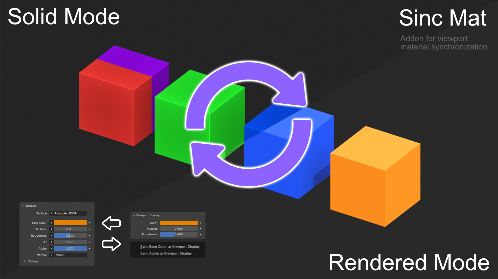

# 🧪 Sync Mat – Blender Add-on

**Sync Mat** is a simple yet powerful add-on for Blender that lets you synchronize your **Base Color** and **Alpha** from the shader nodes to the **Viewport Display** color.  
Perfect for maintaining visual consistency in Solid/Eevee modes, exports, or material previews.

---

---

## 🎯 Features

- Sync **Base Color** → Viewport Display color  
- Sync **Alpha** → Viewport Display alpha  
- Context-aware shortcuts:
  - **Click** = active object only
  - **Shift + Click** = selected objects
  - **Ctrl + Click** = all objects in the scene

---

## 📍 Location

Accessible via **Right-Click** on the material in the **Material Properties panel** (context menu).

---

## 💡 Use Cases

- Improve look in **Solid mode**  
- Prepare assets for **glTF / VRM** export  
- Avoid broken color previews in **Eevee**  
- Maintain consistent alpha visibility

---

## 🔧 Installation

1. Download `sync_mat.zip` (or manually zip the `.py` file).  
2. In Blender: `Edit > Preferences > Add-ons > Install`  
3. Enable **Sync Mat** from the list.

---

## 🧑‍💻 Requirements

- Blender **4.3+** (including **5.0+**)  
- Works with **Principled BSDF** materials only

---

## ✅ Version Compatibility

- Minimum supported Blender version: **4.3**
- Compatible with Blender **4.3+** and **5.0+** (including newer 5.x builds)

---

## 📜 License

GPL-3.0-or-later — free to use, modify, and distribute.

---

## 🤖 Author

Made with ❤️ by **Olst** & GPT  
Follow the project: [X/Twitter @OlstFlow](https://x.com/@OlstFlow) *(if you'd like to link it)*

---

